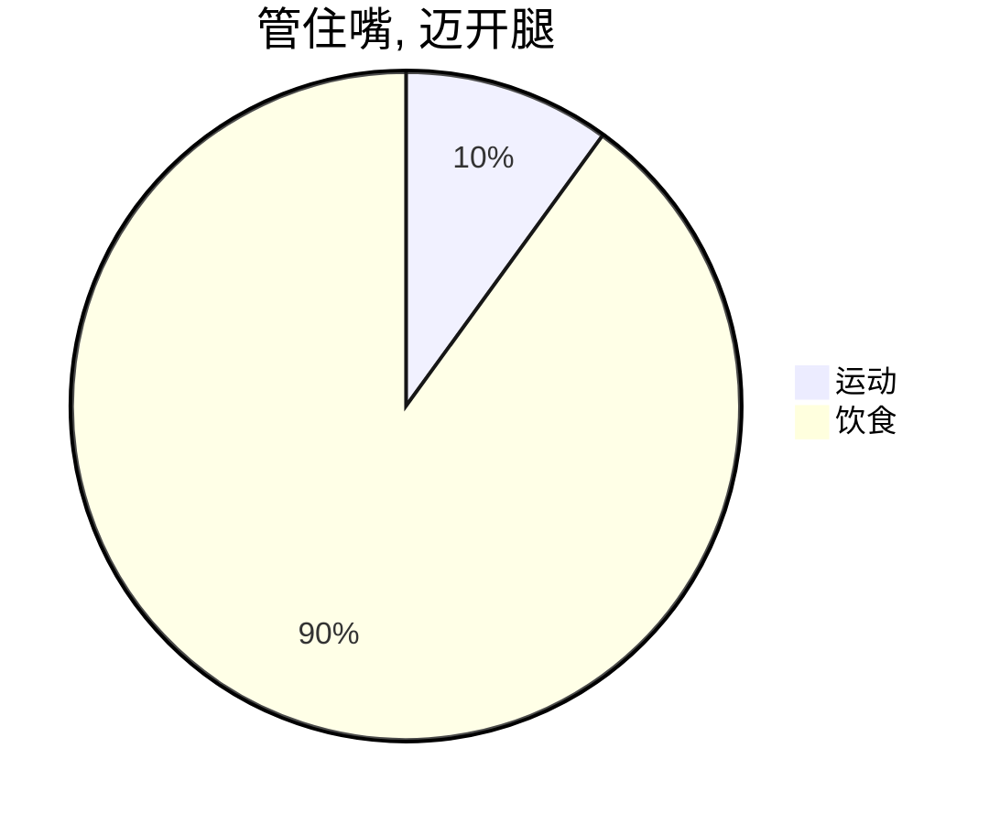

## 简介

以前也尝试过各种减肥方法, 但都坚持不下去. 这些年身边也有很多减肥成功的例子, 有健身的, 有一天骑行 100km 的, 有每天跑步 10km 的, 有坚持健身 3 年的, 还有精确计算每顿饭摄入多少热量的, 条条道路都能减肥, 看你能坚持哪种

我上大学前一直是个瘦子, 上大学期间是标准体重, 毕业后胖了整整 10 年. 最近认真减肥 4 个月掉秤 35 斤. 在此记录下自己的减肥小技巧. 其实也非常简单: 饮食 + 运动

## 饮食

- 清淡
  - 少油
  - 少盐
  - 少调料
- 饮食特点
  - 高蛋白 (牛肉)
  - 优质脂肪 (葡萄籽油)
  - 低碳水 (少吃米饭)
  - 低糖
  - 蔬菜
  - 纯净水, 泡茶

| 就餐 | 时间          | 饭量   | 饮食                  |
| ---- | ------------- | ------ | --------------------- |
| 早餐 | 07:00 - 07:30 | 7 分饱 | 水煮蛋,玉米,牛奶,燕麦 |
| 午餐 | 11:50 - 12:20 | 7 分饱 | 牛肉,绿叶菜,半碗米饭  |
| 晚餐 | 05:00 - 06:00 | 4 分饱 | 燕麦,玉米,茶叶蛋      |

- 主食: 米饭, 玉米, 红薯, 燕麦
- 肉: 牛腩, 牛腱子, 猪梅花肉, 猪里脊肉, 鸡腿
- 调料: 生抽(零添加剂), 十三香
- 夜宵: 晚饭后不要吃任何东西
- 饥饿: 饥饿是一种只会持续 1 分钟的感觉, 喝口水骗过大脑即可
- 不要吃零食, 饮料, 没事多看配料表
- 自己做饭, 不要吃公司食堂, 外卖
- 称体重: 起床, 如厕前后, 就餐前后, 睡前, 都称一下, 感受体重变化的时间段以及 diff
- 快速减脂弊端: 失眠, 掉发
- 掉发: 应该早点就吃鱼油

## 运动

运动对减肥的贡献不大, 但会让人变得开心, 健康. 对于体积较大的人, 不用去健身房, 不用尝试跑步,跳绳,游泳,爬楼梯, 相信每个小胖都尝试过, 根本坚持不下去. 可以参考我的运动模式: 骑共享单车. 早上 10km; 中午 15km; 晚上 10km

这些数字没啥讲究, 住的地方到公司刚好 10km, 中午期间从 百度科技园 到 北大西门 来回 15km. 最开始骑行 10km 需要 55 分钟, 现在是 37 分钟

## 体重变化情况

| 日期  | 体重(斤) |
| ----- | -------- |
| 06.01 | 170.7    |
| 06.10 | 164.9    |
| 06.20 | 162.9    |
| 07.01 | 157.6    |
| 07.10 | 155      |
| 07.20 | 153.6    |
| 08.01 | 149.2    |
| 08.10 | 147.4    |
| 08.20 | 144.2    |
| 09.01 | 141      |
| 09.10 | 136.9    |
| 09.20 | 138      |
| 09.30 | 136      |
| 10.07 | 144      |
| 10.11 | 136.1    |
| 10.20 | 134.5    |
| 11.01 | 136.3    |

## 骑行数据

| 月份 | 里程数(km) |
| ---- | ---------- |
| 06   | 20         |
| 07   | 213        |
| 08   | 495        |
| 09   | 355        |
| 10   | 346        |

## 免责声明

以上为个人减肥经历, 后面是否反弹, 是否有后遗症均未知, 仅供参考. 请减肥时请带点脑子, 别瞎尝试!
