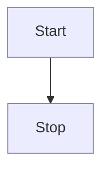
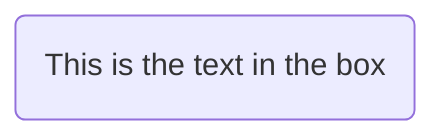
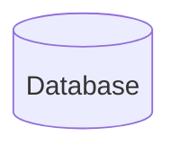
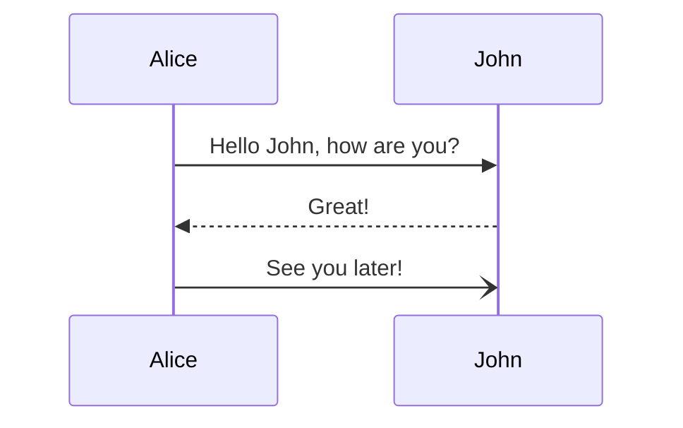
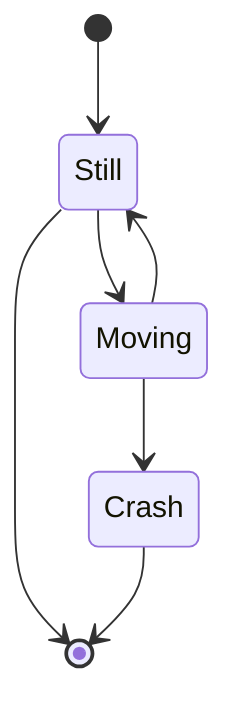

# 格式

## 斜体

```md
_italic_
```

_italic_

## 加粗

```md
**bold**
```

**bold**

## 加粗+斜体

```md
**_bold+italic_**
```

**_bold+italic_**

## 删除线

```md
~~strikethrough~~
```

~~strikethrough~~

## html 标签

```html
<sup>sup</sup>
<sub>sub</sub>
<mark>mark</mark>
<u>underline</u>
```

- m<sup>3</sup>
- a<sub>i + 1</sub>
- Log<sup>n</sup><sub>e</sub>
- <mark>mark</mark>
- <u>underline</u>

## 链接

```md
[github](https://github.com)
```

[github](https://github.com)

## 图片

```md


```


## 内联代码

```md
`inline code`
```

我是内联 `inline code` 标签

# 标题

```md
# 一级标题

## 二级标题

### 三级标题

#### 四级标题
```

# 分隔线

```md
---
```

---

# 引用

```md
> quote
```

> quote

# 代码

<pre><code>```language
write your code here
```</code></pre>

```js
console.log('markdown')
```

# 列表

## 无序列表

```md
- item1
- item2
- item3

* item1
* item2
* item3

- item1
- item2
- item3
```

- item1
- item2
- item3

* item1
* item2
* item3

- item1
- item2
- item3

## 有序列表

```md
1. item1
2. item2
3. item3
```

1. item1
2. item2
3. item3

# 任务列表

```md
[x] task 1
[] task 2
```

- [x] task 1
- [ ] task 2

# 表格

```md
| Tables        |      Are      |   Cool |
| ------------- | :-----------: | -----: |
| col 3 is      | right-aligned | \$1600 |
| col 2 is      |   centered    |   \$12 |
| zebra stripes |   are neat    |    \$1 |
```

| Tables        |      Are      |   Cool |
| ------------- | :-----------: | -----: |
| col 3 is      | right-aligned | \$1600 |
| col 2 is      |   centered    |   \$12 |
| zebra stripes |   are neat    |    \$1 |

# Mermaid

[About Mermaid](https://mermaid.js.org/intro)

## Flowcharts

<pre><code>```mermaid
flowchart TD
  Start --> Stop
```</code></pre>



<pre><code>```mermaid
flowchart LR
  Start --> Stop
```</code></pre>


<pre><code>```mermaid
flowchart LR
  id1(This is the text in the box)
```</code></pre>



<pre><code>```mermaid
flowchart LR
  id1[(Database)]
```</code></pre>



## Sequence Diagrams

<pre><code>```mermaid
sequenceDiagram
  Alice->>John: Hello John, how are you?
  John-->>Alice: Great!
  Alice-)John: See you later!
```</code></pre>



## State Diagrams

<pre><code>```mermaid
stateDiagram-v2
  [*] --> Still
  Still --> [*]

  Still --> Moving
  Moving --> Still
  Moving --> Crash
  Crash --> [*]
```</code></pre>



# Math

- [KaTeX](https://katex.org)
- [LaTeX](https://www.latex-project.org)
- [MathJax](https://www.mathjax.org)

```
$E = mc^2$
```

质能方程 $E = mc^2$ ，E 表示能量，m 代表质量，而 c 则表示光速（常量，c=299792458m/s）。 由阿尔伯特·爱因斯坦提出。 该方程主要用来解释核变反应中的质量亏损和计算高能物理中粒子的能量。

```
$$ a^2 + b^2 = c^2 $$
```

$$ a^2 + b^2 = c^2 $$

```
$$ {f(x)=a_nx^n+a_{n-1}x^{n-1}+a_{n-2}x^{n-2}}+\cdots $$
```

$$ {f(x) = a_nx^n + a_{n-1}x^{n-1} + a_{n-2}x^{n-2}} + \cdots $$

```
$$ {f(x) = a_nx^n + a_{n-1}x^{n-1} + a_{n-2}x^{n-2}} + \cdots $$
```

$$ x = {-b \pm \sqrt{b^2 - 4ac} \over 2a + 1} $$

# markdown-it

- markdown-it-task-lists
- markdown-it-attrs
- markdown-it-anchor

[commonmark](https://github.com/commonmark/commonmark.js)

# Referrence

- [GFM: GitHub Flavored Markdown](https://github.github.com/gfm)
- [Markdown Guide](https://www.markdownguide.org)
- [commonmark](https://commonmark.org)
- [working with advanced formatting](https://docs.github.com/en/get-started/writing-on-github/working-with-advanced-formatting)
- [basic writing and formatting syntax](https://docs.github.com/en/get-started/writing-on-github/getting-started-with-writing-and-formatting-on-github/basic-writing-and-formatting-syntax)
- [math support in markdown](https://github.blog/2022-05-19-math-support-in-markdown)
